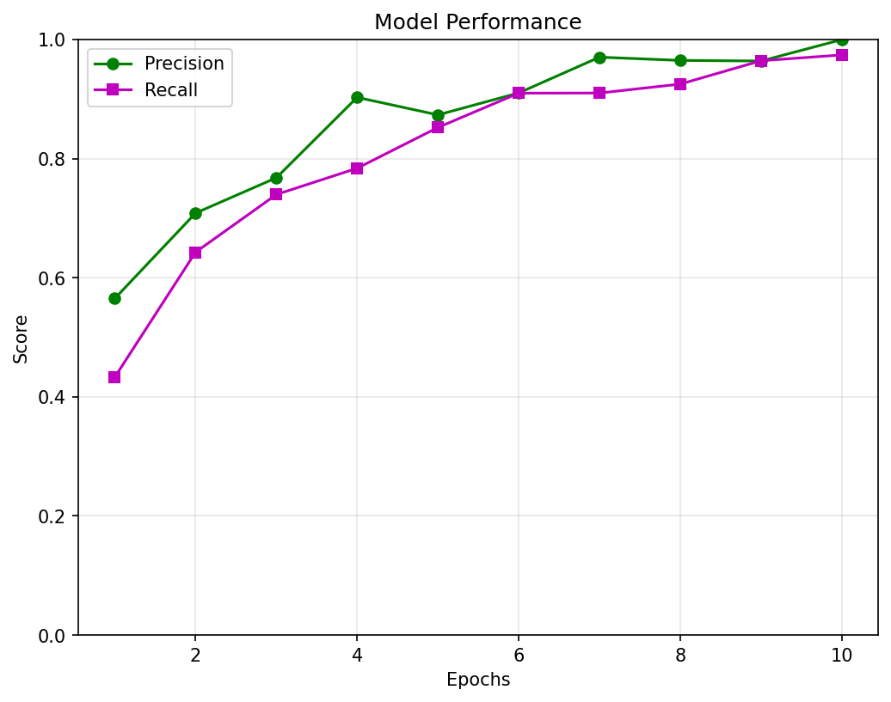

# Week3: AI 기반 데이터 모델링 및 OpenCV를 활용한 결과 시각화

## 프로젝트 개요

AI와 OpenCV를 활용한 객체 탐지 모델 학습 및 결과 시각화 프로젝트입니다.
YOLOv8 모델을 사용하여 커스텀 데이터셋으로 학습하고, OpenCV를 통해 탐지 결과를 시각화합니다.

## 폴더 구조

```
Yolo project/
├── src/
│   ├── data.yaml      # 데이터셋 설정
│   ├── train.py       # 모델 학습
│   ├── detect.py      # 객체 탐지 + OpenCV 시각화
│   └── visualize.py   # 성능 그래프 시각화
├── results/
│   ├── detection_result.jpg
│   └── model_performance.png
├── docs/
│   └── README.md
└── datasets/
    ├── train/{images, labels}
    ├── valid/{images, labels}
    └── test/{images, labels}
```

## 환경 설정

### 필수 패키지 설치

```bash
pip install torch torchvision opencv-python matplotlib ultralytics
```

## 실행 방법

### 1. 데이터셋 준비

`datasets/` 폴더에 YOLO 형식의 데이터셋을 준비합니다.

### 2. 모델 학습

```bash
cd src
python train.py
```

### 3. 객체 탐지

```bash
python detect.py
```

### 4. 결과 시각화

```bash
python visualize.py
```

## 실행 결과

### 모델 평가 결과

| 메트릭 | 값 |
|--------|------|
| mAP@0.5 | 0.XXX |
| mAP@0.5:0.95 | 0.XXX |
| Precision | 0.XXX |
| Recall | 0.XXX |

### 학습 곡선



### 객체 탐지 결과


## 성능 향상 방법

1. **데이터 증강 (Augmentation)**: 이미지 회전, 밝기 조절, 노이즈 추가
2. **하이퍼파라미터 튜닝**: 학습률 조정, Batch Size 조정
3. **더 큰 모델 사용**: yolov8s.pt, yolov8m.pt 등
